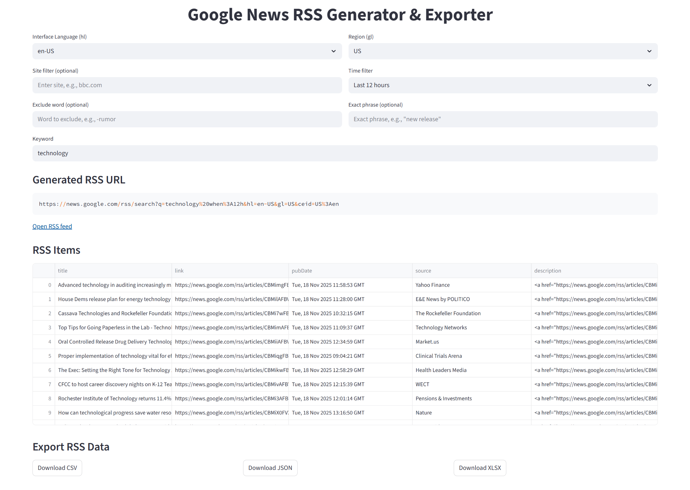

# Google News RSS Generator & Exporter

[](https://hasdata.com/)

This Streamlit app lets you easily generate custom **Google News RSS feed URLs**, preview the feed results, and export them in multiple formats (CSV, JSON, XLSX).
It is useful for developers, researchers, analysts, and anyone who needs structured news data from Google News.

## 🚀 Features

[](https://hasdata.com/)
* Build Google News RSS queries with:

  * Keyword
  * Site filter (e.g., `site:bbc.com`)
  * Time filter (1 hour, 12 hours, 1 day, 7 days)
  * Excluded words
  * Exact phrases
  * Language and region selection (`hl` and `gl`)
* Automatic RSS URL generation
* Open the generated feed directly
* Parse RSS results and show them in a table
* Export feed items as:

  * **CSV**
  * **JSON**
  * **XLSX**

## 🛠️ Installation

Make sure you have Python 3.11+ installed.

```bash
pip install streamlit pandas feedparser xlsxwriter
```

## ▶️ Run the App

```bash
streamlit run app.py
```

Replace `app.py` with your file name if different.


## How It Works

1. Choose your **region (gl)** and **language interface (hl)**
2. Enter:

   * keyword
   * site filter
   * time filter
   * excluded word
   * exact phrase
3. The app builds a Google News RSS query
4. It fetches and parses the RSS feed
5. You can:

   * preview the parsed items
   * download them in your preferred format

## Output

Each article includes the title, link, publication date, source, and description. All results come directly from Google News, and the accuracy of the output depends on what Google provides.

## Use Cases

The app works well for tracking topics, monitoring specific sites, collecting data for NLP experiments, or integrating curated news streams into dashboards and scripts.

## Disclaimer

These examples are for **educational purposes** only. Learn more about [the legality of web scraping](https://hasdata.com/blog/is-web-scraping-legal).
* This tool does **not** bypass Google News; it only builds standard RSS queries.
* Results depend entirely on what Google News returns.

## 📎 More Resources

* [Scraping Google News: The 2025 Python Guide](https://hasdata.com/blog/web-scraping-google-news)
* [Join the community on Discord](https://hasdata.com/join-discord)
* [Star this repo if helpful ⭐](#)